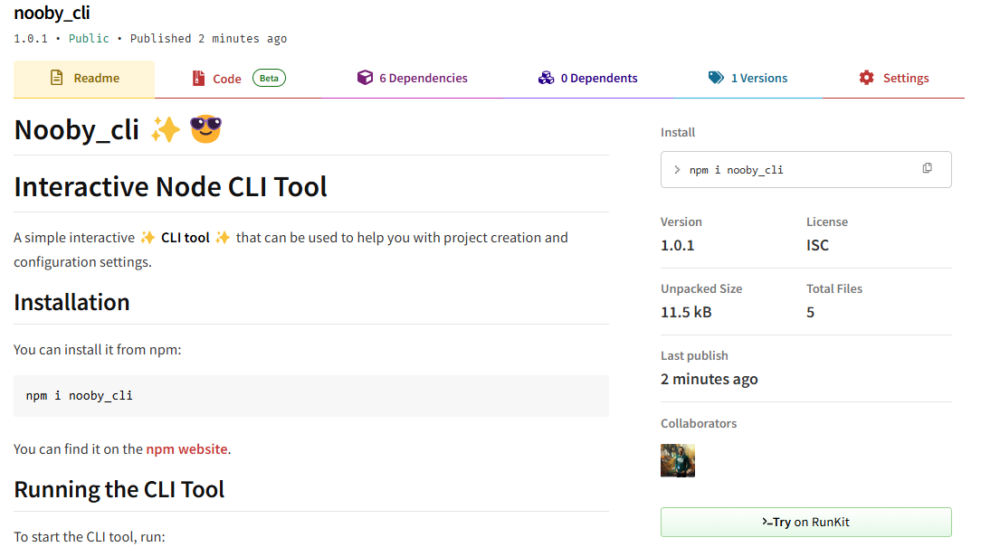
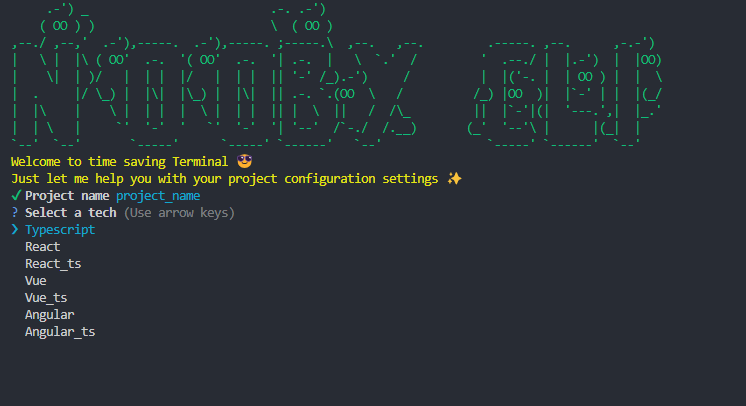

# Nooby_cli ✨😎

# Interactive Node CLI Tool

A simple interactive ✨ **CLI tool** ✨ that can be used to help you with project creation and configuration settings.

## Installation

You can install it from npm:

```sh
npm i nooby_cli
```

You can find it on the [Npm website](https://www.npmjs.com/package/nooby_cli) 👀

## Running the CLI Tool

To start the CLI tool, run:

```sh
nooby_cli <command>
```

## Available Commands

- **`c | create`**: Create a new project.
- **`l | list`**: List all technologies.
- **`help`**: Provide help and usage information.
- **`version`**: Display the current version of the CLI tool.

### Example

```sh
$ nooby_cli c
```



### Additional Resources

You can also find each technology's documentation link after the installation process.

### Contributing

We welcome contributions! Please follow these steps:

1. Fork the repository.
2. Create a new branch (`git checkout -b feature-branch`).
3. Make your changes.
4. Commit your changes (`git commit -m 'Add some feature'`).
5. Push to the branch (`git push origin feature-branch`).
6. Open a pull request.

### License

This project is licensed under the MIT License - see the [LICENSE](LICENSE) file for details.

### Contact

For any questions or feedback, feel free to reach out:

- **Email**: noureldinfarag4@gmail.com


